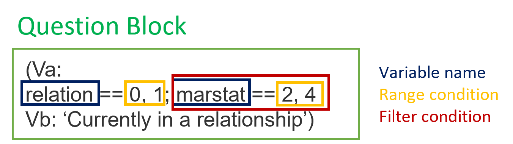

# **Preparing the programing template for *surveychecks***

## **Example survey**

Suppose you want to ask the following eight survey questions:

>**1. How old are you?**

*Please write down your age* <br>
**_________**

>**2. What is your marital status?**

- [ ] Married
- [ ] Divorced  
- [ ] Seperated  
- [ ] Single, never married

>**3. Are you currently in a relationship?**

- [ ] Yes
- [ ] No

>**4. Are you currently living with your partner?**

- [ ] Yes
- [ ] No

>**5. How many people beside you live in your household?**

- [ ] none
- [ ] 1
- [ ] 2
- [ ] 3 and more

>**6. What is your employment status?**

- [ ] Full-time
- [ ] Part-time
- [ ] Contract/Temporary
- [ ] Unemployed
- [ ] Student or in vocational training
- [ ] Retired
- [ ] Other, namely _________

>**7. What is your monthly net-income in Euro?**

**_________**

>**8. What is your monthly *household* net-income in Euro?**

**_________**

When writing down the survey question in this manner it is unclear how they will show up in the data. That is why we have to extend the information within each of these questions. This additional information is obviously not meant to be shown to participants, but will allow you to program the questions into a surveying tool and run automated variable, range and filter checks on the data using *surveychecks*.

## **How to write down the *surveycheck* syntax into documents**

Let us enrich the example by providing additional information on how the data will look like, such as variable names, types, values and filter conditions. Hereby we answer the following questions:

- How many variables does a question spawn?
- How should I name my variables?
- What is the data type of my variable?
- What is the range condition of my variable?
- Does the variable have filter conditions?
- What are allowed missing values and their codes?
  
Within *surveychecks* these questions need to answered explicitly through the following compenents:

Question Block | Variable Name | Range Condition | Filter Condition |
| ----------- | ----------- | ----------- | ----------- | ----------- |
| The question block or <br> question that spawn <br> the variable(s) | The names of the <br> variables as they <br> should appear in <br> in the data | The allowed values <br> of a variable <br> including information <br> on variable type | Whether the variable <br> is only displayed  given <br>a specific filter condition |

Consider question three. The question only spawns one dichotomous variable. It also does not make sense to ask this question every particpant, since those who are married are in a relationship. Consequently, a filtercondition needs to be defined as well.

Let's apply the *surveychecks* components to question three.



Everything between `(Va: ... Vb:...)` is a question block which the document parser will look for and read into memory. Each new line between `(Va: ... Vb:...)` is a variable the question block spawns (in the case above only one variable). The syntax of each line/variable is the same. It starts with the variable name to be recorded, followed by two equal signs and the range condition for the variable. Optionally, if the question is only asked given some filter condition(s) a semicolon is added, followed by the filter condition. The filter condition is composed of the name of the filter variable followed by the range condition that needs to evaluate to TRUE in order for the question to be displayed.

There are a few rules that should be kept in mind when writing down the information in this manner. The following definitions should help:

***Question block***

- a question block (e.g. single question, survey screen or survey battery) containing information on a single or multiple variables
- a question block is everything between `(Va: ... Vb:)`
  - each new line in the question block after `(Va:` contains information on a variable
    - e.g. the following question block contains two variables

      ```text
      (Va:
      emplstat == 1-7
      emplstat_o != 'NaN'; emplstat == 7
      Vb: 'Employment status')
      ```

***Variable name***

- unique name of a variable written as one consecutive entry without spaces

***Range condition***

- all possible numeric values of a variable
  - specify multiple values with a **comma** *(implicit OR condition)*
    - e.g. `relation == 0, 1` -> expands to `relation == 0 | relation == 1`
  - specify multiple*consecutive* values with a **minus sign** *(implicit OR condition)*
    - e.g. `age == 18-105` -> expands to `age == 18 | age == 19 | ... | age == 105`
  - specify both consecutive and nonconsecutive ranges of the same variable with the addition of **plus** sign
    - e.g. `emplstat 1-7 + -97, -98`
  - for a **large** range conditions use the following syntax:
    - `income >= 0 & income <= 500000` -> does not expand

- string values
  - when evaluating open questions that can take any string value use **!= 'NaN'**
    - e.g. `emplstat_o != 'NaN'`

***Filter condition***

- the filter condition of a variable, written after the range condition of the variable and initiated with a **semicolon**
  - e.g. `relation == 0, 1; marstat == 2, 4`
- the rules for writing the range condition of the filter condition are the same as writing normal range condition
- use `|` for **OR** conditions and `&` for **AND** conditions

Under the hood, *surveychecks* utilizes [pandas.eval](https://pandas.pydata.org/pandas-docs/stable/reference/api/pandas.eval.html) for evaluating range and filter conditions. The parser, as it is implemented right now, looks for a specific number of spaces between each word and sign. For the parser to extract the right inforamtion you need to use the same spacing as the ones shown in the examples.

### **Note on missing value codes**

Before applying the *surveycheck* rules to the example survey we need to define some possible missing values. In a simple survey with filter conditions you need at least **two** values to distinguish between missing values from **item-nonresponse and filter missing**. Depending on the complexity of the survey additional missing-indicators should be used. The missing indicators are usually numeric variables, where the value of the variable is not included in the naturally occuring range condition of any of the variables in the survey. For this reason negative value codes are often used as they do seldomly make sense in a range condition. For this example we use the following missing value codes:

```text
item nonresponse  = -95
filter missing    = -55
```

When your survey is not able to differentiate between item-nonresponse and filter missing, you won't be able to meaningfully use a few of the filter tests within *surveychecks*.

## **Applying the *surveycheck* guidelines to the example survey**

Finally, we apply everything to the example survey: [^1]

>**1. How old are you?**

*(Va: <br> age == 18-105 + -95 <br> Vb: 'Age in years')*

*Please write down your age*  
**[18-105]** _________

>**2. What is your marital status?**

*(Va:<br> marstat == 1-4 + -95 <br>Vb: 'Marital status')*

**[1]** Married  
**[2]** Divorced  
**[3]** Seperated  
**[4]** Single, never married

>**3. Are you currently in a relationship?**

*(Va:<br>relation == 0, 1, -95, -55; marstat == 2, 4 <br>Vb: 'Currently in a relationship')*

**[0]** Yes  
**[1]** No

>**4. Are you currently living with your partner?**

*(Va:<br>partner == 0, 1, -95, -55; marstat == 1-3 | relation == 1<br>Vb: 'Living with partner')*

**[0]** Yes  
**[1]** No

>**5. How many people beside you live in your household?**

*(Va:<br>household == 1-4 + -95<br>Vb: 'Number of poeple living in the household')*

**[1]** none  
**[2]** 1  
**[3]** 2  
**[4]** 3 and more  

>**6. What is your employment status?**

*(Va:
emplstat == 1-7 + -95<br>emplstat_o != 'NaN'; emplstat == 7<br>Vb: 'Employment status')*

**[1]** Full-time  
**[2]** Part-time  
**[3]** Contract/Temporary  
**[4]** Unemployed  
**[5]** Student or in vocational training  
**[6]** Retired  
**[7]** Other, namely _________  

>**7. What is your yearly net-income in Euro?**

*(Va:<br>(income >= 0 & income <= 500000) | income == -95, -55 ; emplstat == 1-4 | emplstat == 7<br>Vb: 'Personal net-income')*

**[0-500000]** _________

>**8. What is your monthly *household* net-income in Euro?**

*(Va:<br>(hincome >= 0 & hincome <= 5000000) | hincome == -95, -55; household == 2-4<br>Vb: 'Household net-income')*

**[0-5000000]** _________

[^1]: the question blocks do not neceserrily have to be in the same document as the survey question text
